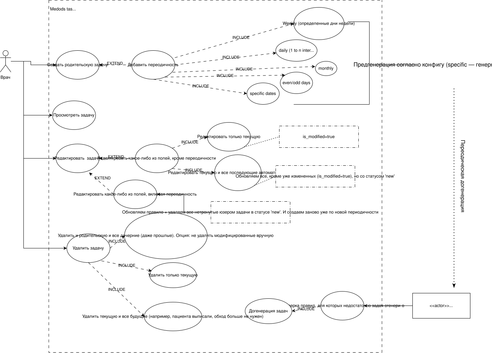

# Task Management Service

Микросервис управления задачами с поддержкой сложных правил периодичности (Recurrence Rules). Разработан в рамках тестового задания с фокусом на чистоту архитектуры, обработку граничных случаев и оптимизацию работы с БД.

---

##  Мои архитектурные решения и предположения

Поскольку часть требований намеренно не была детализирована, в ходе проектирования я принял ряд самостоятельных решений, чтобы сделать систему жизнеспособной в реальной production-среде:

### 1. Генератор задач (Стратегия «Плавающего окна»)
Вместо единоразовой генерации задач на годы вперед, я реализовал фоновый **Planner Worker**.
> **Обоснование:** Бесконечная генерация забивает базу «мертвыми» данными. Планировщик периодически проверяет базу и догенерирует задачи только тогда, когда их количество падает ниже установленного лимита (настраивается в конфигах для разных типов). В реальной среде `PlannerInterval` имеет смысл установить на 24 часа, так как минимальный шаг — один день. Но я установил на 1 минуту, чтобы вам удобно было проверять. Кстати, там еще логи накинул, так что в логе контейнера можно посмотреть.

### 2. Защита пользовательских данных при серийном обновлении
Добавлен флаг `is_modified` для отслеживания задач, которые пользователь отредактировал вручную.
> **Обоснование:** Если юзер меняет шаблонную задачу (например, добавляет комментарий), а затем обновляет всю серию целиком, его ручные правки **не должны затираться**. Массовое обновление применяется только к `is_modified = false`. Если пользователь меняет саму периодичность (например, с Daily на Weekly), немодифицированные задачи со статусом 'new' удаляются и пересоздаются по новым правилам. В реальной среде я бы возможно сходил к заказчику или аналитику и узнал бы, в каком случае лучше менять флаг is_modified, потому что не все типы изменения должны защищать задачу от удаления

### 3. Ограничения редактирования дат в сериях
Предполагается, что на стороне фронтенда при выборе опции "Изменить для всех" можно менять **только время** для ScheduledAt, но не день даты.
> **Обоснование:** Полное изменение даты (дня) для всей серии нарушит математику периодичности (Recurrence Rule). Дата жестко привязана к правилу, а время может быть скорректировано. С учетом ограниченного времени на таску, я лично считаю данное решение разумным

### 4. Расширенные сценарии календаря и новые типы
* **Переполнение месяца:** Если периодичность выпадает на 31-е число, а в месяце 30 дней (или 28 в феврале), задача автоматически смещается на последний доступный день месяца.
* **Добавлен тип Weekly:** Хоть это и не требовалось явно, я добавил тип "Еженедельно".
> **Обоснование:** Сценарий использования (работа медперсонала) подразумевает процедуры по определенным дням недели. Без этого типа система была бы неполноценной для заказчика.

### 5. Три режима удаления (Cascade & Orphan)
Реализована возможность удалить 1 задачу, текущую задачу вместе с будущими (но немодифицированные и в статусе `'new'`) или всю серию целиком (но только немодифицированные).
> **Обоснование:** При удалении серии (`DeleteModeEntireSeries`), задачи, которые уже были изменены вручную (`is_modified`),
> **остаются в базе**, как и в случае `DeleteModeFuture`(но тут еще и на статус смотрим, должен быть только `new`) как самостоятельные сущности (Orphaned tasks через `ON DELETE SET NULL`).
> Это сохраняет, например, историю болезни/действий для системы.

---

## Проектирование и процесс разработки

Задачи формулировались и декомпозировались как при реальной командной разработке. Весь процесс, включая отчасти дискуссии с самим собой и ИИ по архитектуре, зафиксирован в [закрытых Issues](https://github.com/AitkulovTimur/test-task-for-junior-backend-developer/issues?q=is%3Aissue%20state%3Aclosed), а разработка фич велась в отдельных ветках.

**Расширенная Use Case диаграмма** (для прояснения пробелов в ТЗ):  


---
## Тестирование API
Для удобства проверки работоспособности сервиса подготовлен файл с примерами запросов (cURL):
👉 **[REQUEST_EXAMPLES.md](./REQUEST_EXAMPLES.md)**


## ⚠️ Ограничения (Future Work)

Из-за временных ограничений на выполнение тестового задания, некоторые аспекты оставлены для дальнейших итераций:
1. **Тестирование:** Написаны некоторые базовые тесты, но для покрытия всех календарных граничных случаев генератора и всех методов для CRUD (високосные года, таймзоны) требуется расширение тестовой базы.
2. **API & Swagger:** Валидация JSONB-поля `RecurrenceParams` реализована на уровне бизнес-логики. Для production-ready состояния требуется детальное описание Swagger-схемы и строгий контракт с фронтендом.
3. **Пагинация:** Эндпоинты получения списков задач не имеют пагинации (offset/limit). Также я не успел написать эндпоинт для получения RecurrenceRule(таблица `recurrence_rules`) сущности 

---


## Требования

- Go `1.23+`
- Docker и Docker Compose

## Быстрый запуск через Docker Compose

```bash
docker compose up --build
```

После запуска сервис будет доступен по адресу `http://localhost:8080`.

Если `postgres` уже запускался ранее со старой схемой, пересоздай volume:

```bash
docker compose down -v
docker compose up --build
```

Причина в том, что SQL-файл из `migrations/0001_create_tasks.up.sql` монтируется в `docker-entrypoint-initdb.d` и применяется только при инициализации пустого data volume.

## Swagger

Swagger UI:

```text
http://localhost:8080/swagger/
```

OpenAPI JSON:

```text
http://localhost:8080/swagger/openapi.json
```

## API

Базовый префикс API:

```text
/api/v1
```

Основные маршруты:

- `POST /api/v1/tasks`
- `GET /api/v1/tasks`
- `GET /api/v1/tasks/{id}`
- `PUT /api/v1/tasks/{id}`
- `DELETE /api/v1/tasks/{id}`